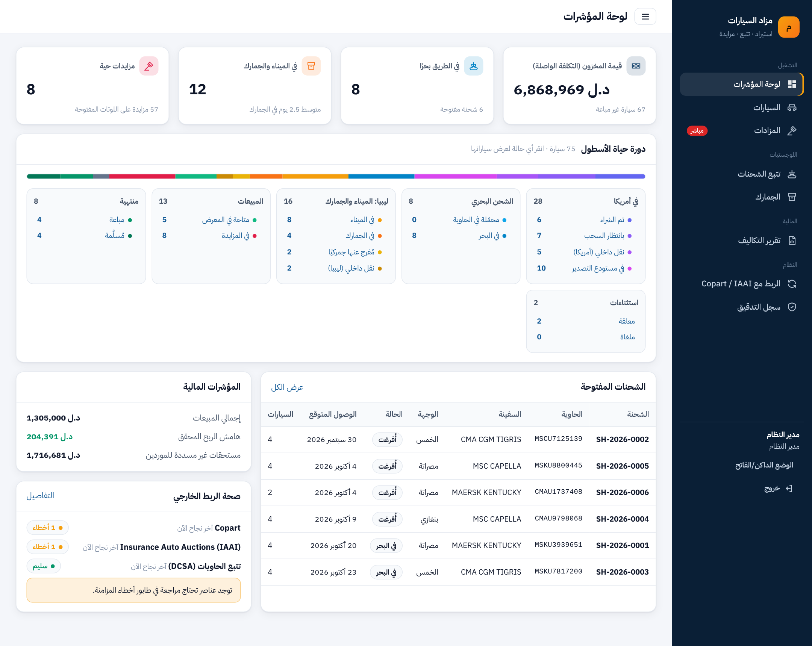

# منظومة مزاد واستيراد السيارات

منظومة متكاملة لشركة تستورد السيارات من مزادات **Copart** و **IAAI** الأمريكية وتبيعها في **ليبيا**. تتبع كل سيارة من لحظة الشراء في أمريكا، مرورًا بالشحن البحري والميناء والجمارك والنقل، حتى بيعها بالمزاد الحي أو البيع المباشر وتسليمها. وتحسب **التكلفة الواصلة** لكل سيارة بدقة، بندًا بندًا وعملةً بعملة.



## ما الذي تقدمه

| المجال | القدرات |
|---|---|
| **التتبع** | 16 حالة لدورة الحياة بقواعد انتقال تفرضها قاعدة البيانات نفسها؛ سجل كامل لكل تغيير؛ تعليق بسبب مع العودة للحالة السابقة؛ خط زمني مرئي |
| **الربط الآلي** | محوّلات Copart و IAAI وتتبع الحاويات (DCSA) واستيراد CSV؛ مزامنة دورية تزايدية؛ عدم تكرار؛ إعادة محاولة بتراجع أُسّي؛ قاطع دائرة؛ طابور أخطاء مع إعادة المعالجة؛ احترام التعديلات اليدوية |
| **الصور** | معرض بعدسة تكبير، وعارض ملء الشاشة حتى 6× (عجلة، قرص، سحب، لوحة مفاتيح)، ومقارنة حتى 4 سيارات مع إبراز الفروق |
| **الشحن والجمارك** | مسار الحاوية المرئي والأحداث؛ لوحة كانبان للبيانات الجمركية؛ الإفراج ينقل السيارة آليًا، وسداد الرسم يُسجَّل تكلفة |
| **المزادات** | مزايدة حية لحظية (SSE)؛ مزايدة آلية بحد سري؛ منع القنص؛ حد أدنى سري؛ تأمين؛ مزاد هجين؛ إغلاق آلي وفاتورة متسلسلة؛ سلامة تامة تحت التنافس |
| **التكاليف** | 19 بندًا في 8 مراحل؛ USD/LYD/EUR بلقطة سعر صرف؛ فعلي وتقديري؛ توزيع تكلفة الحاوية بدقة تامة؛ إلغاء بسبب لا حذف |
| **التقارير** | تقرير التكلفة الواصلة والهامش لكل سيارة؛ تصدير **Excel** (3 أوراق بمعادلات) و **CSV** و **PDF** |
| **الأمان** | scrypt، تشفير AES-256-GCM للبيانات الشخصية، 6 أدوار، CSRF/XSS/SQLi، قفل الحساب، حد المعدل، سجل تدقيق غير قابل للتعديل |

## التشغيل السريع

المتطلبات: Node.js 22+ و PostgreSQL 14+ (أو Docker).

```bash
# الخيار أ: Docker
docker compose up -d db
npm install
cp .env.example .env          # القيم الافتراضية تعمل محليًا
npm run db:reset              # المخطط + بيانات تجريبية (58 سيارة، مزاد حي)
npm start                     # http://localhost:4000

# الخيار ب: كل شيء في Docker
docker compose up --build     # ثم نفّذ db:reset مرة واحدة من داخل الحاوية أو من جهازك
```

**الحسابات التجريبية** (كلمة المرور لكلها: `Demo@2026pass`):

| الدور | البريد |
|---|---|
| مدير النظام | `admin@auction.ly` |
| العمليات | `ops@auction.ly` |
| المحاسبة | `accountant@auction.ly` |
| المبيعات | `sales@auction.ly` |
| اطلاع | `viewer@auction.ly` |
| مزايدون | `bidder1@auction.ly`, `bidder2@auction.ly`, `bidder3@auction.ly` |

في وضع التطوير يعمل **محاكٍ** لـ Copart و IAAI وتتبع الحاويات (`MOCK_FEEDS=true`). اضغط "مزامنة الآن" في شاشة الربط لترى سيارات جديدة تُستورد، وحالات تتقدم، وأخطاء عابرة تُعاد، وعنصرًا تالفًا يذهب لطابور الأخطاء. أول لوت في المزاد الحي ينتهي بعد 6 دقائق من البذر، لعرض الإغلاق الآلي.

## الاختبارات

```bash
npm test                 # 88 اختبارًا (وحدة + تكامل على PostgreSQL حقيقي) — كلها ناجحة
npm run test:unit        # 48 اختبار وحدة بلا قاعدة بيانات
```

نتائج الأداء مع 20 ألف سيارة و60 مزايدًا متزامنًا: تسجيل المزايدة p95 = 103ms، وقائمة السيارات p95 = 255ms، وبث المزايدة لـ 300 متصفح خلال 41ms، وسلامة سجل المزايدات 100%. التفاصيل في [docs/09](docs/09-test-plan-and-results.md).

## المخرجات والوثائق

| # | المخرج | الملف |
|---|---|---|
| 1 | تحليل المتطلبات (الكيانات، الأدوار، دورة الحياة، المتطلبات) | [docs/01-requirements.md](docs/01-requirements.md) |
| 2 | **مخطط قاعدة البيانات** (ERD + قاموس الجداول + القيود) | [docs/02-database.md](docs/02-database.md) · [db/schema.sql](db/schema.sql) |
| 3 | **آلية الربط مع Copart و IAAI** (المحوّلات، التزامن، الأخطاء، الدمج) | [docs/03-integration-copart-iaai.md](docs/03-integration-copart-iaai.md) |
| 4 | **تصميمات UI/UX** (نظام التصميم + 19 شاشة) | [docs/04-ui-ux.md](docs/04-ui-ux.md) · [docs/ui/](docs/ui/) |
| 5 | **إدارة التكاليف والتقرير** + نماذج تصدير حقيقية | [docs/05-cost-management.md](docs/05-cost-management.md) · [docs/samples/](docs/samples/) |
| 6 | سياسات الأمان | [docs/06-security-policy.md](docs/06-security-policy.md) |
| 7 | دليل المستخدم | [docs/07-user-guide.md](docs/07-user-guide.md) |
| 8 | دليل الصيانة والتشغيل | [docs/08-maintenance-guide.md](docs/08-maintenance-guide.md) |
| 9 | **خطة الاختبار والنتائج** (وظيفي، أمان، أداء) | [docs/09-test-plan-and-results.md](docs/09-test-plan-and-results.md) |
| 10 | النشر التدريجي والتدريب | [docs/10-deployment-and-training.md](docs/10-deployment-and-training.md) |
| — | **النموذج الأولي العامل** | هذا المستودع (`src/`, `public/`) |

## التقنيات

| الطبقة | الاختيار | السبب |
|---|---|---|
| الخادم | Node.js 22 + Express (ESM) | خفيف، I/O غير متزامن يناسب البث اللحظي، 3 تبعيات إنتاج فقط |
| قاعدة البيانات | PostgreSQL 16 | `NUMERIC` دقيق للمال، Triggers لقواعد الأعمال، `LISTEN/NOTIFY` للتوسع الأفقي، أقفال استشارية للمهام الدورية، `JSONB` لحمولات المصادر |
| اللحظية | Server-Sent Events + LISTEN/NOTIFY | أبسط من WebSocket لبث باتجاه واحد، يمر عبر البروكسيات، وإعادة اتصال تلقائية |
| الواجهة | HTML/CSS/JS قياسي (ES Modules) بلا خطوة بناء | لا سلسلة أدوات تتقادم؛ قوالب آمنة بهروب تلقائي؛ CSP صارم |
| Excel | exceljs داخل Worker thread | ملف xlsx حقيقي دون تجميد الخادم |
| الاختبار | node:test + Playwright | بلا أطر اختبار خارجية |

## الترخيص والبيانات

كل البيانات التجريبية (العملاء، الأرقام، الموردون) **وهمية**. أسعار الصرف ونسب الرسوم الجمركية في البذرة **توضيحية** وليست مرجعًا رسميًا. صور السيارات في النموذج رسوم متجهية مولّدة. في الإنتاج تُستخدم صور مشتريات الشركة الفعلية.
