# 01 — تحليل المتطلبات التفصيلية

## 1. نطاق المنظومة

شركة تستورد سيارات من مزادات أمريكية (Copart و IAAI) وتبيعها في ليبيا عبر مزادات داخلية أو بيع مباشر. المنظومة تغطي السيارة من لحظة رسو المزاد في أمريكا حتى تسليمها للمشتري في ليبيا، وتجمع في مكان واحد:

- **التتبع:** أين السيارة الآن، وفي أي مرحلة.
- **التكلفة:** كم كلّفت حتى الآن، مفصّلة حسب المرحلة والعملة.
- **البيع:** المزايدة الحية والبيع المباشر.
- **الربط الآلي:** تحديث البيانات تلقائيًا من المصادر الخارجية.

## 2. أصحاب المصلحة والأدوار

| الدور | الرمز في النظام | المسؤوليات | ما لا يستطيعه |
|---|---|---|---|
| مدير النظام | `ADMIN` | كل شيء + المستخدمون + سجل التدقيق + التكاملات | — |
| العمليات واللوجستيات | `OPERATIONS` | تحديث حالة السيارات، الشحنات، الجمارك، تشغيل المزامنة، استيراد CSV | إلغاء بنود التكلفة |
| المحاسبة | `ACCOUNTANT` | تسجيل التكاليف وإلغاؤها، التكاليف المشتركة، التقارير والتصدير | تغيير حالة السيارة |
| المبيعات والمزادات | `SALES` | إنشاء اللوتات، المزايدة نيابة عن العملاء (مزاد هجين)، العملاء | تعديل التكاليف |
| الإدارة العليا (اطلاع) | `VIEWER` | قراءة كل الشاشات والتقارير | أي تعديل |
| العميل المزايد | `BIDDER` | رؤية السيارات المعروضة، المزايدة اليدوية والآلية | رؤية التكاليف، الحد الأدنى السري، هوية المزايدين الآخرين، السيارات غير المعروضة |

## 3. الكيانات الأساسية

| الكيان | الوصف | أهم السمات |
|---|---|---|
| **السيارة** `vehicles` | الوحدة المركزية التي يرتبط بها كل شيء | VIN (فريد ومُتحقق منه)، رقم مخزون داخلي، المواصفات الفنية، الضرر، نوع الملكية، الحالة الحالية، الإصدار (للتزامن المتفائل) |
| **قائمة المصدر** `source_listings` | بيانات اللوت كما وردت من Copart/IAAI | رقم اللوت، الساحة، تاريخ البيع، ACV، تقدير الإصلاح، سعر الشراء، الحمولة الأصلية الخام + بصمتها |
| **الصورة** `vehicle_images` | صور المصدر وصور التصوير الداخلي | النوع (خارجي/داخلي/محرك/ضرر)، مفتاح التخزين، الأبعاد، بصمة SHA-256 لمنع التكرار |
| **الشحنة** `shipments` | حاوية/حجز بحري | رقم الحجز، البوليصة، رقم الحاوية (ISO 6346)، السعة، الخط الملاحي، السفينة، موانئ التحميل والتفريغ، ETD/ATD/ETA/ATA |
| **حدث الشحنة** `shipment_events` | أحداث التتبع (DCSA) | الرمز، المكان، الوقت، المصدر |
| **النقل البري** `inland_transports` | السحب في أمريكا والنقل في ليبيا | المسار، الناقل، أوقات الاستلام والتسليم |
| **البيان الجمركي** `customs_declarations` | الإجراء الجمركي لكل سيارة | رقم البيان، المنفذ، المخلص، القيمة المقدرة، الرسم، الحالة |
| **العميل** `customers` | المشتري (فرد/معرض/شركة) | بيانات مشفرة (الهاتف/الهوية) + بصمات بحث، حالة التحقق KYC |
| **مزاد / لوت / مزايدة** | `auction_events`, `auction_lots`, `bids`, `proxy_bids`, `bidder_registrations` | التوقيت، منع القنص، التأمين، الحد الأدنى السري، الزيادة الدنيا، المزايدة الآلية |
| **البيع والدفعات** | `sales`, `payments` | رقم فاتورة متسلسل، السعر، الدفعات بعملاتها |
| **التكلفة** | `vehicle_costs`, `shared_costs`, `cost_categories`, `exchange_rates` | البند، المرحلة، العملة، سعر الصرف المحفوظ، فعلي/تقديري، مسدد/غير مسدد، الإلغاء المنطقي |
| **المزامنة** | `external_sources`, `sync_jobs`, `sync_dead_letters`, `inbound_events` | المؤشر التزايدي، قاطع الدائرة، طابور الأخطاء، صندوق أحداث الـ webhook |
| **التدقيق** | `audit_logs` | من فعل ماذا ومتى ومن أي عنوان — للإلحاق فقط |

## 4. دورة حياة السيارة (16 حالة)

```mermaid
stateDiagram-v2
    direction LR
    [*] --> PURCHASED: استيراد آلي من Copart/IAAI
    PURCHASED --> AWAITING_PICKUP: سُدِّد الثمن
    AWAITING_PICKUP --> US_INLAND_TRANSIT: سُحبت من الساحة
    US_INLAND_TRANSIT --> AT_US_WAREHOUSE: وصلت مستودع التصدير
    AT_US_WAREHOUSE --> LOADED: حُمِّلت في الحاوية
    LOADED --> AT_US_WAREHOUSE: أُنزلت (تغيير حجز)
    LOADED --> IN_TRANSIT_SEA: أبحرت السفينة
    IN_TRANSIT_SEA --> AT_PORT_LIBYA: وصلت وفُرِّغت
    AT_PORT_LIBYA --> IN_CUSTOMS: قُدِّم البيان
    IN_CUSTOMS --> CUSTOMS_CLEARED: إفراج
    CUSTOMS_CLEARED --> LY_INLAND_TRANSIT
    CUSTOMS_CLEARED --> IN_STOCK
    LY_INLAND_TRANSIT --> IN_STOCK: وصلت المعرض
    IN_STOCK --> IN_AUCTION: أُدرجت في مزاد
    IN_AUCTION --> IN_STOCK: لم تُبع
    IN_AUCTION --> SOLD: رسا المزاد
    IN_STOCK --> SOLD: بيع مباشر
    IN_TRANSIT_SEA --> SOLD: بيع مسبق
    AT_PORT_LIBYA --> SOLD: بيع مسبق
    IN_CUSTOMS --> SOLD: بيع مسبق
    CUSTOMS_CLEARED --> SOLD: بيع مسبق
    SOLD --> DELIVERED: تسليم
    PURCHASED --> CANCELLED: ألغى المصدر البيع
    AWAITING_PICKUP --> CANCELLED
    DELIVERED --> [*]
```

**الحالة الخاصة `ON_HOLD` (معلقة):** يمكن الدخول إليها من أي حالة غير نهائية، مع سبب إلزامي. تحفظ قاعدة البيانات الحالة السابقة في `hold_return_status`، ورفع التعليق يعيد السيارة إليها فقط (أو إلى `CANCELLED`).

**قواعد صارمة:**
1. الانتقالات محفوظة في جدول `vehicle_status_transitions`. يرفض Trigger في قاعدة البيانات أي انتقال خارجه، حتى لو جاء من `UPDATE` مباشر.
2. حالتا `IN_AUCTION` و`SOLD` تضبطهما عمليات النظام فقط (إدراج في مزاد / رسو / بيع)، ولا تتوفران كأزرار يدوية.
3. المزامنة الآلية تُقدِّم الحالة للأمام فقط. إذا قفز المصدر عدة مراحل، تُسجَّل كل خطوة وسيطة في السجل بمصدر `SYNC`.
4. كل تغيير يُسجَّل في `vehicle_status_history` (من، إلى، المصدر، السبب، الفاعل، الوقت) وفي سجل التدقيق.

## 5. المتطلبات الوظيفية

| # | المتطلب | التحقق منه |
|---|---|---|
| F-01 | استيراد مشتريات Copart و IAAI آليًا ودوريًا، وإنشاء السيارة وتكاليف الشراء تلقائيًا | اختبار تكامل "استيراد جديد ينشئ السيارة…" |
| F-02 | تحديث الحالة اللوجستية من المصدر ومن تتبع الحاويات | اختبار "تقدم لوجستي متعدد المراحل…" |
| F-03 | استيراد CSV كمسار بديل بنفس قواعد التحقق | اختبار "استيراد CSV عبر الواجهة" |
| F-04 | عرض الصور بجودة عالية مع عدسة تكبير وعارض ملء الشاشة (حتى 6×) ومقارنة | لقطات 05–07، 09 |
| F-05 | مقارنة 2–4 سيارات مع إبراز الفروق والأفضل | لقطة 09 |
| F-06 | تتبع الشحنات (المسار، الأحداث، السيارات داخل الحاوية) | لقطة 12 |
| F-07 | لوحة الجمارك بمراحل البيان، والإفراج ينقل السيارة آليًا | اختبار "الجمارك: الإفراج…" + لقطة 13 |
| F-08 | مزايدة حية مع تحديث لحظي، مزايدة آلية، منع القنص، حد أدنى سري، تأمين | اختبارات قسم المزايدة + لقطة 11 |
| F-09 | إغلاق آلي للمزاد وإصدار فاتورة متسلسلة أو إعادة السيارة للمخزون | اختبار "إغلاق آلي…" |
| F-10 | تسجيل تكاليف تفصيلية متعددة العملات بسعر صرف محفوظ | اختبار "تكلفة بالدولار…" |
| F-11 | توزيع التكاليف المشتركة (الحاوية) بدقة تامة | اختبار "التكلفة المشتركة…" |
| F-12 | تقرير تكلفة واصلة لكل سيارة مع التصدير Excel/CSV/PDF | اختبار Excel + `docs/samples/` |
| F-13 | سجل تدقيق غير قابل للتعديل | اختبار "سجل التدقيق للإلحاق فقط" |

## 6. المتطلبات غير الوظيفية

| المجال | المتطلب | الحالة المقيسة |
|---|---|---|
| الأداء | قائمة السيارات p95 < 500 ملّي ثانية مع 20 ألف سيارة و50 مستخدمًا متزامنًا | p95 = 255 ملّي ثانية ✅ |
| الأداء | تسجيل مزايدة p95 < 300 ملّي ثانية مع 60 مزايدًا متنافسًا | p95 = 103 ملّي ثانية ✅ |
| اللحظية | وصول المزايدة لكل المتابعين < 1 ثانية | 300 متصفح خلال 41 ملّي ثانية ✅ |
| السلامة | لا مزايدتان بنفس المبلغ، وسجل المزايدات متصاعد بصرامة تحت الضغط | 927 مزايدة على 3 لوتات متنافسة: سجل سليم 100% ✅ |
| الأمان | كلمات مرور مجزأة، بيانات حساسة مشفرة، صلاحيات حسب الدور، حماية CSRF/XSS/SQLi | 13 اختبار أمان ✅ |
| الإتاحة | التوسع الأفقي (عدة نسخ) دون تعارض | أقفال استشارية + LISTEN/NOTIFY (انظر 08) |
| الاستخدام | واجهة عربية RTL، متجاوبة حتى 360px، وضع داكن، لوحة مفاتيح | لقطات 16–19 |

## 7. افتراضات وقيود

- **لا توجد واجهة برمجية عامة مفتوحة لـ Copart أو IAAI.** يفترض التصميم الوصول عبر تغذية بيانات مرخّصة لحساب العضو/الوسيط، أو مزوّد بيانات مرخّص، أو ملفات تصدير CSV. التفاصيل في [03-integration-copart-iaai.md](03-integration-copart-iaai.md).
- **التعرفة الجمركية الليبية** ليست مُشفَّرة في الكود. يُدخِل المخلّص القيمة المقدرة والرسم الفعلي من البيان، والتقديرات المسبقة تُعلَّم "تقديري". الأرقام في البيانات التجريبية توضيحية فقط.
- **أسعار الصرف** تُدخَل يدويًا يوميًا (رسمي أو موازٍ حسب سياسة الشركة). لكل بند تكلفة لقطة من السعر الساري في تاريخه.
- **عملة البيع** هي الدينار الليبي، وعملات التكلفة هي USD و LYD و EUR.
