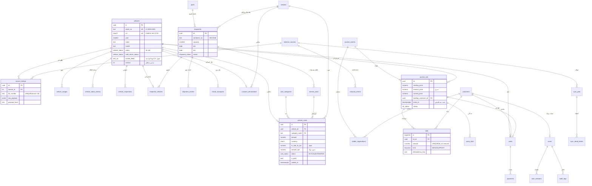

# 02 — مخطط قاعدة البيانات

- **المحرك:** PostgreSQL 14 أو أحدث (مُختبَر على 16).
- **المخطط:** `auction`.
- **الملف القابل للتنفيذ:** [`db/schema.sql`](../db/schema.sql). يُطبَّق بـ `npm run db:schema` أو `psql -f db/schema.sql`.
- **الحجم:** 33 جدولًا، عرضان (Views)، 85 فهرسًا، 3 Triggers، 3 تسلسلات (Sequences)، و26 نوعًا معدّدًا (Enum).

## 1. مبادئ التصميم

1. **الدقة المالية:** كل المبالغ `NUMERIC(14,3)` (الدينار الليبي بثلاث منازل)، ولا `FLOAT` في أي مكان. الطبقة البرمجية تتعامل مع المبالغ كنصوص و`BigInt` بالمِلّيم (`src/domain/money.js`).
2. **لقطة سعر الصرف:** كل تكلفة تحفظ `fx_rate_to_lyd` لحظة تسجيلها. المبلغ بالدينار عمود مولَّد `GENERATED ALWAYS AS (round(amount * fx_rate_to_lyd, 3)) STORED`، فلا يمكن أن يختلف عن مصدره، ولا يتغير التقرير التاريخي إذا تغير السعر لاحقًا.
3. **قاعدة البيانات خط الدفاع الأخير:** قواعد الأعمال الحرجة مفروضة بقيود وTriggers، لا في الكود فقط:
   - انتقالات الحالة.
   - سعة الحاوية.
   - عدم إدراج السيارة في مزادين مفتوحين.
   - عدم تكرار مبلغ المزايدة.
   - سجل تدقيق للإلحاق فقط.
   - صيغة VIN ورقم الحاوية.
4. **لا حذف فعلي للبيانات المالية:** إلغاء بند تكلفة يملأ `voided_at` و`void_reason`. قيد CHECK يمنع الإلغاء بلا سبب.
5. **العزل عن المصادر الخارجية:** كل ما يخص Copart/IAAI في جداول مستقلة (`source_listings`, `sync_*`, `inbound_events`). تُحفظ الحمولة الخام كاملة (`raw_payload JSONB`) لإعادة المعالجة والتدقيق. إضافة مصدر جديد = صف في `external_sources` + محوّل في الكود.
6. **البيانات الشخصية مشفرة:** هاتف العميل ورقم هويته يُخزَّنان مشفّرين (AES-256-GCM على مستوى التطبيق)، ومعهما بصمة HMAC تسمح بالبحث بالمطابقة التامة دون فك التشفير.

## 2. مخطط الكيانات والعلاقات (ERD)

## 3. قاموس الجداول

### 3.1 السيارات والمصادر

| الجدول | الغرض | قيود وفهارس مهمة |
|---|---|---|
| `vehicles` | السيارة ومواصفاتها وحالتها الحالية | `vin` فريد مع `CHECK (vin ~ '^[A-HJ-NPR-Z0-9]{17}$')`؛ `hold_requires_reason`؛ فهرس على الحالة، وفهرس على (الماركة، الطراز، السنة)، وفهرس نصي GIN للبحث |
| `vehicle_status_transitions` | الانتقالات المسموحة (23 انتقالًا) | مفتاح مركب (من، إلى) |
| `vehicle_status_history` | كل تغيير حالة: من، إلى، المصدر (MANUAL/SYNC/SYSTEM)، السبب، الفاعل | فهرس (vehicle_id, occurred_at DESC) |
| `source_listings` | بيانات اللوت كما في Copart/IAAI | `UNIQUE (source_id, lot_number)`؛ `raw_payload` + `payload_hash` للمعالجة مرة واحدة |
| `vehicle_images` | صور المصدر والصور الداخلية | `UNIQUE (vehicle_id, sha256)` يمنع التكرار؛ فهرس جزئي فريد يضمن صورة رئيسية واحدة |
| `vehicle_inspections` | فحوص المراحل (الاستلام، الميناء، المعرض…) | `findings JSONB` |

### 3.2 اللوجستيات

| الجدول | الغرض | قيود |
|---|---|---|
| `ports` | موانئ أمريكا وليبيا (UN/LOCODE) | مصراتة، طرابلس، بنغازي، الخمس + هيوستن، سافانا، نيويورك، لوس أنجلوس، بالتيمور |
| `vendors` | الموردون: مزاد، سحب، وكيل شحن، خط ملاحي، تأمين، مخلّص، نقل، ورشة | `UNIQUE (name, vendor_type)` |
| `shipments` | الحاوية/الحجز | صيغة رقم الحاوية ISO 6346؛ `pol <> pod`؛ فهرس (status, eta) |
| `shipment_vehicles` | السيارات في الحاوية | فهرس فريد على `vehicle_id` (تُشحن مرة واحدة) + Trigger للسعة |
| `shipment_events` | أحداث التتبع | `UNIQUE (shipment_id, event_code, occurred_at)` يمنع تكرار حدث وارد من التتبع الآلي |
| `inland_transports` | السحب في أمريكا، والنقل في ليبيا | `delivered_at >= picked_up_at` |
| `customs_declarations` | البيان الجمركي (بيان واحد لكل سيارة) | `vehicle_id UNIQUE`؛ فهرس على الحالة |
| `documents` | المستندات (الملكية، البوليصة، البيان، أمر الإفراج…) | مرتبطة بسيارة أو شحنة أو بيان (واحد على الأقل) + بصمة SHA-256 |

### 3.3 المزادات والمبيعات

| الجدول | الغرض | قيود |
|---|---|---|
| `auction_events` | حدث المزاد: التوقيت، مدة منع القنص، التمديد، التأمين المطلوب | `ends_at > starts_at` |
| `auction_lots` | السيارة داخل المزاد | فهرس فريد جزئي: سيارة واحدة في لوت مفتوح واحد؛ `reserve_price >= starting_price`؛ `version` |
| `bidder_registrations` | تسجيل العميل في المزاد + التأمين | `UNIQUE (event, customer)` و`UNIQUE (event, paddle_no)` |
| `bids` | سجل المزايدات (للإلحاق) | `UNIQUE (lot_id, amount)` و`UNIQUE (lot_id, customer_id, idempotency_key)` |
| `proxy_bids` | الحد الأقصى السري للمزايدة الآلية | مفتاح (lot, customer) |
| `sales` | البيع (بالمزاد أو مباشر) برقم فاتورة متسلسل | `vehicle_id UNIQUE`؛ بيع المزاد يتطلب `lot_id` |
| `payments` | الدفعات بعملتها وسعر صرفها | — |

### 3.4 التكاليف

| الجدول | الغرض |
|---|---|
| `cost_categories` | 19 بندًا في 8 مراحل: الشراء، لوجستيات أمريكا، الشحن البحري، الميناء الليبي، الجمارك، النقل الداخلي، التجهيز، أخرى (انظر 05) |
| `exchange_rates` | سعر الدينار مقابل كل عملة يوميًا؛ `UNIQUE (currency, effective_date)` |
| `vehicle_costs` | بند التكلفة على السيارة (عمود `amount_lyd` مولَّد) |
| `shared_costs` | تكلفة على مستوى الشحنة تُوزَّع على سياراتها (يربطها `vehicle_costs.shared_cost_id`) |

### 3.5 التكامل والتدقيق

| الجدول | الغرض |
|---|---|
| `external_sources` | إعدادات المصدر: المحوّل، الدورية، حد المعدل، المؤشر التزايدي، عدّاد الإخفاقات، قاطع الدائرة |
| `sync_jobs` | كل جولة مزامنة وإحصاءاتها؛ فهرس فريد جزئي يمنع جولتين جاريتين لنفس (المصدر، النوع) |
| `sync_dead_letters` | العناصر الفاشلة بعد المحاولات؛ فهرس فريد جزئي: صف مفتوح واحد لكل (مصدر، مرجع) |
| `inbound_events` | أحداث الـ webhook الواردة؛ `UNIQUE (source_id, external_event_id)` للمعالجة مرة واحدة |
| `audit_logs` | سجل التدقيق؛ Trigger يرفض UPDATE و DELETE |
| `users`, `user_sessions` | المستخدمون (scrypt) والجلسات (تُخزَّن بصمة الرمز فقط) |

## 4. العروض (Views)

| العرض | المحتوى |
|---|---|
| `v_vehicle_landed_cost` | لكل سيارة: مجموع التكلفة حسب كل مرحلة من المراحل الثماني، الإجمالي، الجزء التقديري، غير المسدد، سعر البيع، والهامش. يغذي التقرير وشاشة السيارة. الأعمدة الوصفية مدرجة في `GROUP BY` حتى تُدفع مرشحات الحالة/الماركة إلى ما قبل التجميع (قِيس: من 1.5 ثانية إلى 150 ملّي ثانية على 20 ألف سيارة). |
| `v_vehicle_tracking` | آخر موقع معروف: الشحنة، الحاوية، السفينة، المواعيد، حالة الجمارك |

## 5. القواعد المفروضة بالـ Triggers

| Trigger | يمنع |
|---|---|
| `trg_vehicle_status` | أي انتقال غير موجود في الجدول؛ تعليق سيارة مباعة/مسلمة/ملغاة؛ رفع التعليق إلى غير الحالة السابقة. يملأ `status_changed_at` آليًا ويحفظ/يمسح `hold_return_status`. |
| `trg_container_capacity` | تحميل سيارة زائدة على سعة الحاوية (مع قفل صف الشحنة لمنع السباق) |
| `trg_audit_immutable` | تعديل سجل التدقيق أو حذفه |

## 6. التوسع ودعم مصادر خارجية جديدة

- **مصدر جديد** (Manheim أو ACV Auctions مثلًا): `INSERT INTO external_sources` + محوّل يُنتج النموذج الموحد (انظر 03). لا يلزم تغيير المخطط.
- **حقول إضافية من المصدر** تبقى متاحة في `raw_payload` دون تعديل الجداول. يُستخرج منها عمود عند الحاجة الفعلية.
- **النمو:** الجداول سريعة النمو (`bids`, `vehicle_costs`, `audit_logs`, `vehicle_status_history`, `sync_jobs`) مرشحة للتقسيم الزمني (`PARTITION BY RANGE`) إذا تجاوزت عشرات الملايين من الصفوف. الحجم الحالي المقيس: 20 ألف سيارة و200 ألف بند تكلفة = 116 ميجابايت.
- **البحث الجزئي** على VIN ورقم المخزون يستخدم `ILIKE '%…%'`، وهو كافٍ حتى عشرات الآلاف (قيس: p50 = 260 ملّي ثانية مع 50 مستخدمًا). عند مئات الآلاف يُضاف `CREATE EXTENSION pg_trgm` وفهارس GIN trigram.
- **الهجرات:** `schema.sql` الحالي هو خط الأساس (v1). كل تغيير لاحق يُكتب كملف هجرة مرقّم (`db/migrations/0002_*.sql`) يُطبَّق مرة واحدة. الإجراء موثّق في [08-maintenance-guide.md](08-maintenance-guide.md).
