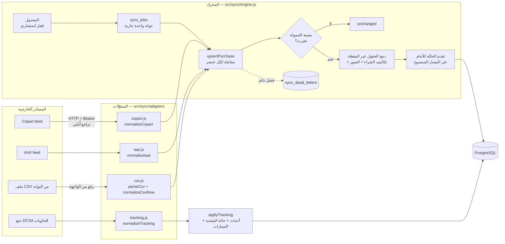

# 03 — آلية الربط مع منصات Copart و IAAI

## 1. الواقع التعاقدي والتقني (اقرأ هذا أولًا)

| الحقيقة | أثرها على التصميم |
|---|---|
| Copart و IAAI **لا تنشران واجهة برمجية عامة مفتوحة** لبيانات المشتريات. | التكامل لا يفترض واجهة عامة، بل "تغذية" تُضبط عبر الإعدادات. |
| الوصول المشروع للبيانات يكون عبر: (أ) حساب العضو/الوسيط الذي تشتري به الشركة وما يتيحه من تغذية أو تصدير، (ب) مزوّد بيانات طرف ثالث مرخّص، (ج) ملفات التصدير (CSV/Excel) من بوابة العضو. | ثلاثة مسارات تنتهي كلها في محرك واحد: محوّل HTTP لكل منصة، ومحوّل CSV. |
| كشط (Scraping) صفحات الموقعين يخالف شروط الاستخدام ويتعطل بأي تغيير في الصفحات. | **مرفوض صراحةً** في هذا التصميم. |
| الصور محمية بحقوق نشر وروابطها قد تنتهي صلاحيتها. | تُنسخ صور مشترياتنا فقط إلى تخزيننا عند الاستيراد، وتُخدَم من عندنا. |
| تتبع الحاويات له معيار مفتوح: **DCSA Track & Trace**. تطبقه خطوط Maersk و MSC و CMA CGM و Hapag-Lloyd، وتغطي المجمّعات عدة خطوط بواجهة واحدة. | محوّل تتبع وحيد على نمط DCSA. |

**الخطوة التعاقدية الأولى قبل الإنتاج:** تؤكد الشركة مع مدير حسابها في Copart و IAAI (أو مع الوسيط المرخّص) شكل التغذية المتاحة: نقطة النهاية، المصادقة، الحقول، حدود المعدل، ووجود webhooks. بعدها تُضبط `COPART_FEED_URL` و`COPART_API_TOKEN` (ونظيراتها) **دون تعديل الكود**، إلا إن اختلفت أسماء الحقول، فيُعدَّل جدول التحويل في المحوّل وحده.

## 2. المعمارية



### 2.1 عقد المحوّل (Adapter contract)

يكفي لإضافة أي مصدر أن يحقق المحوّل:

```js
{
  code: 'COPART',
  normalize(raw) -> NormalizedPurchase,          // يرمي NormalizeError إن كانت البيانات تالفة
  async *fetchPurchases({ since }) -> { items: raw[], cursor }   // صفحات متتالية
}
```

### 2.2 النموذج الموحّد (NormalizedPurchase)

| الحقل | المعنى | من Copart | من IAAI |
|---|---|---|---|
| `externalRef` | رقم اللوت/المخزون | `lotNumber` | `stockNumber` |
| `vin` | رقم الهيكل (يُتحقق من الصيغة **وخانة التحقق**) | `vin` | `VIN` |
| `year`, `make`, `model`, `trim` | الطراز | `year`, `make`, `modelGroup`, `trim` | `Year`, `Make`, `Model`, `Series` |
| `odometer`, `odometerBrand` | العداد وحالته | `odometer`, `odometerBrand` (A/N/E/X) | `Odometer.value`, `Odometer.brand` |
| `titleType` | نوع الملكية | `titleGroup` | `TitleBrand` (CLEAR→CLEAN، NON-REPAIRABLE→PARTS_ONLY) |
| `primaryDamage`, `secondaryDamage` | الضرر | `damageDescription`, `secondaryDamage` | `PrimaryDamage`, `SecondaryDamage` |
| `hasKeys`, `runAndDrive` | المفاتيح، وهل تعمل وتسير | `hasKeys` (YES/NO)، `highlights` يحوي `RUN_AND_DRIVE` | `Keys` (bool)، `StartCode = 'Run & Drive'` |
| `yardName`, `yardState`, `yardZip` | الساحة | `yardName`, `locationState`, `locationZip` | `Branch.*` |
| `purchasePriceUsd`, `buyerFeeUsd`, `otherFeesUsd` | سعر الشراء والرسوم | `purchase.price/buyerFee/otherFees` | `Purchase.SalePrice/Fees.Buyer/Fees.Other` |
| `paymentDueAt`, `pickupDeadlineAt` | مهلة الدفع، ومهلة السحب (بعدها رسوم تخزين) | `purchase.paymentDue/pickupDeadline` | `Purchase.PaymentDue/PickupBy` |
| `logisticsStatus` | PAID / PICKED_UP / DELIVERED_TO_WAREHOUSE / CANCELLED | من `paidAt/pickedUpAt/deliveredAt/cancelled` | من `PaymentStatus/PickupStatus/Voided` |
| `images[]` | روابط الصور ونوعها | `imageUrls[]` | `Images[].Url/Type` |

> أسماء الحقول أعلاه **على نمط** ما يعرضه الموقعان. التطابق الحرفي يُثبَّت عند استلام مواصفات التغذية الفعلية، وكل التحويل معزول في دالة `normalize` واحدة لكل مصدر، ومغطى باختبارات وحدة (`test/unit/adapters-security.test.js`).

## 3. أنماط التزامن

| النمط | متى | التنفيذ |
|---|---|---|
| **دوري تزايدي (Polling)** | الافتراضي | المجدول يعمل كل دقيقة، ويشغّل كل مصدر مستحق حسب `sync_interval_sec` (15 دقيقة للمشتريات، وساعة للتتبع). يطلب `updatedSince = آخر مؤشر − 5 دقائق`. الهامش يغطي فرق الساعة بين الخادمين، وبصمة الحمولة تمنع إعادة الكتابة. |
| **يدوي** | زر "مزامنة الآن" | `POST /api/integrations/{COPART\|IAAI\|TRACKING}/sync` (ADMIN/OPERATIONS). يتجاوز قاطع الدائرة عمدًا لاختبار عودة المصدر. |
| **Webhook** (إن أتاحه المصدر) | تحديثات فورية | جدول `inbound_events` بقيد `UNIQUE (source_id, external_event_id)` جاهز لاستقبال الحدث مرة واحدة ثم تمريره لنفس `upsertPurchase`. نقطة الاستقبال تُفعَّل عند توفر مواصفات المصدر (تتطلب التحقق من توقيع HMAC للحدث). |
| **ملف CSV** | عند تعذر التغذية الآلية | `POST /api/integrations/csv` (حتى 5000 سطر / 5MB): نفس التطبيع والتحقق والدمج. |

## 4. معالجة الأخطاء والاستثناءات

| المستوى | الحالة | المعالجة |
|---|---|---|
| **الطلب HTTP** (`http-client.js`) | 5xx، انقطاع، مهلة 15 ثانية | حتى 4 إعادات بتراجع أُسّي مع تشويش (500ms → 1s → 2s → 4s، سقف 30s) |
| | 429 | احترام `Retry-After` |
| | 4xx أخرى (401/403/404) | **لا** إعادة: الخطأ دائم ويحتاج تدخلًا (مفتاح منتهٍ مثلًا) |
| | استجابة ليست JSON أو بلا الحقل المتوقع | فشل الجولة برسالة واضحة |
| **العنصر الواحد** | بيانات تالفة (VIN خاطئ، لوت بلا رقم) | `NormalizeError` → طابور الأخطاء فورًا (لا فائدة من الإعادة). بقية العناصر تكمل. |
| | خطأ عابر في قاعدة البيانات (تعارض تسلسل، قفل) | إعادتان، ثم طابور الأخطاء |
| | العنصر نفسه يفشل مجددًا | يُحدَّث صفه المفتوح (`attempts + 1`) بدل إنشاء صف جديد |
| | العنصر ينجح لاحقًا | تُغلق أخطاؤه المفتوحة تلقائيًا |
| **الجولة** | فشل كامل (المصدر متوقف) | `status = FAILED` + `consecutive_failures + 1` |
| **المصدر** | 3 جولات فاشلة متتالية | **قاطع الدائرة**: إيقاف الجدولة 15 دقيقة، ثم 30، ثم 60، حتى ساعتين. أول نجاح يعيد العداد للصفر. |
| **التداخل** | جولتان متزامنتان (خادمان أو زر + مجدول) | فهرس فريد جزئي على `sync_jobs (source, type) WHERE status IN (QUEUED, RUNNING)` يرفض الثانية (`SyncBusy`) |
| **التعطل** | الخادم سقط أثناء جولة | المجدول يعلّم أي جولة `RUNNING` لأكثر من 30 دقيقة بأنها `FAILED` لتحرير القفل |
| **الإصلاح اليدوي** | — | شاشة "الربط" تعرض طابور الأخطاء، وزر "إعادة المعالجة" يعيد تشغيل الحمولة المحفوظة بعد تصحيح السبب |

**كل ما سبق مُختبَر آليًا.** انظر قسم "محرك المزامنة" في `test/integration/system.test.js` و"عميل HTTP" في `test/unit/adapters-security.test.js`.

## 5. قواعد الدمج وحل التعارض

1. **الهوية:** يُطابَق العنصر أولًا بـ (المصدر، رقم اللوت)، ثم بـ VIN. لذلك إذا اشترت الشركة نفس السيارة من مصدر آخر أو أُعيد بيعها، تُربط بنفس السجل.
2. **سيارة جديدة:** تُنشأ بحالة `PURCHASED` ورقم مخزون من التسلسل، وتُنشأ تكاليف الشراء (السعر، رسوم المشتري، الرسوم الأخرى) بالدولار بسعر صرف يوم البيع.
3. **سيارة موجودة:** تُحدَّث الحقول الفنية التي تغيّرت فعلًا فقط، وتُستثنى الحقول المسجلة في `vehicles.locked_fields`. هذه الحقول عدّلها موظف يدويًا بعد الفحص الفعلي، فقراره يتقدم على المصدر.
4. **الحالة:** تتقدم للأمام فقط. يُحسب أقصر مسار مسموح (`forwardPath`) وتُسجَّل كل خطوة. لا تُمَس السيارة المعلقة أو التي تجاوزت المرحلة. إذا ألغى المصدر البيع، تُلغى السيارة فقط إن كانت لم تُسحب بعد.
5. **التكاليف** لا تُستبدل عند التحديث، فهي سجل مالي. أي فرق لاحق يُسجّله المحاسب بندًا مستقلًا أو بإلغاء البند مع ذكر السبب.

| حالة المصدر | حالة السيارة الناتجة |
|---|---|
| `PAID` | `AWAITING_PICKUP` |
| `PICKED_UP` | `US_INLAND_TRANSIT` |
| `DELIVERED_TO_WAREHOUSE` | `AT_US_WAREHOUSE` |
| `CANCELLED` | `CANCELLED` (إن كانت `PURCHASED` أو `AWAITING_PICKUP` فقط) |
| تتبع الحاوية: `DEPARTED` / `IN_TRANSIT` / `TRANSSHIPMENT` | سيارات الحاوية → `IN_TRANSIT_SEA` |
| تتبع الحاوية: `ARRIVED` / `DISCHARGED` | سيارات الحاوية → `AT_PORT_LIBYA` |

## 6. الصور

1. عند الاستيراد يُسجَّل لكل صورة: الرابط الأصلي، والنوع، و`sha256(url)`. القيد `UNIQUE (vehicle_id, sha256)` يمنع التكرار عند كل مزامنة.
2. **في الإنتاج:** عامل صور (images worker) ينزّل كل صورة جديدة إلى تخزين كائني (S3 أو MinIO)، ويولّد أحجامًا (مصغّرة 320، عرض 1280، أصلية)، ويحسب الأبعاد. تُخدَم الصور عبر CDN برؤوس `Cache-Control: immutable` وروابط موقّعة قصيرة العمر.
3. **في النموذج الأولي:** تُولَّد صور SVG متجهية توضيحية لكل سيارة (لونها، هيكلها، موضع ضررها)، لعرض المعرض والتكبير دون استخدام صور محمية بحقوق نشر. الكود في `src/services/media.js`.

## 7. المراقبة والتنبيه

| المؤشر | المصدر | عتبة التنبيه المقترحة |
|---|---|---|
| عمر آخر مزامنة ناجحة | `external_sources.last_success_at` | أكثر من 3 × الدورية |
| قاطع الدائرة مفتوح | `circuit_open_until > now()` | فوري |
| عناصر طابور الأخطاء المفتوحة | `sync_dead_letters WHERE resolved_at IS NULL` | أكثر من 10 أو أي عنصر عمره أكثر من 24 ساعة |
| نسبة الفشل في الجولة | `items_failed / items_seen` | أكثر من 5% |

تظهر هذه المؤشرات في لوحة المؤشرات ("صحة الربط الخارجي") وفي شاشة الربط.

## 8. الإعدادات

| المتغير | الوصف |
|---|---|
| `COPART_FEED_URL`, `COPART_API_TOKEN` | عنوان تغذية Copart ومفتاحها |
| `IAAI_FEED_URL`, `IAAI_API_TOKEN` | عنوان تغذية IAAI ومفتاحها |
| `TRACKING_API_URL`, `TRACKING_API_TOKEN` | واجهة تتبع الحاويات (خط ملاحي أو مجمّع) |
| `MOCK_FEEDS` | `true` يشغّل محاكيًا داخليًا للمصادر الثلاثة (تطوير وعرض فقط؛ يُعطَّل افتراضيًا في الإنتاج) |
| `MOCK_FAULT_RATE` | نسبة الأخطاء العابرة التي يحقنها المحاكي (افتراضي 0.15)، لإثبات مسار إعادة المحاولة |
| `SCHEDULER_ENABLED` | تشغيل المجدول على هذه النسخة |

**الأسرار** لا تُخزَّن في قاعدة البيانات. الحقل `external_sources.credentials_ref` مرجع لخزنة الأسرار فقط.

## 9. المحاكي (للتطوير والعرض)

`src/sync/mock-feeds.js` يحاكي المصادر الثلاثة على المسار `/mock/*`:

- صفحات متعددة (pagination).
- حالات لوجستية تتقدم كل دقيقتين.
- أخطاء 503 و 429 عشوائية بنسبة `MOCK_FAULT_RATE`.
- عنصر تالف عمدًا في كل مصدر (VIN خاطئ)، يظهر في طابور الأخطاء ليثبت أن المسار يعمل.
- تتبع حاويات يتقدم يومًا لكل دقيقة حقيقية.

## 10. إضافة مصدر جديد (Manheim أو ACV مثلًا) — خطوات

1. `INSERT INTO external_sources (code, name, adapter, sync_interval_sec) VALUES ('MANHEIM', 'Manheim', 'manheim', 900);`
2. إنشاء `src/sync/adapters/manheim.js` يصدّر `normalizeManheim` و`createManheimAdapter` بنفس العقد.
3. تسجيله في `getAdapter()` في `engine.js`، وإضافة متغيري البيئة.
4. كتابة اختبار وحدة لـ `normalize` بعينات حقيقية من المصدر.
5. إضافة الرمز إلى قائمة المصادر المجدولة في `schedulerTick` وإلى مسار التشغيل اليدوي.
