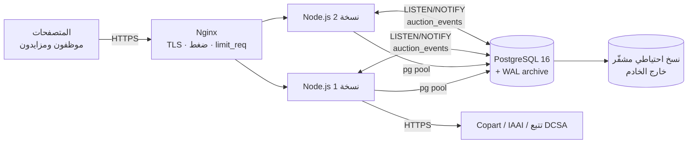

# 08 — دليل الصيانة والتشغيل

## 1. المكونات



| المكون | المسؤولية | ملاحظات التوسع |
|---|---|---|
| `src/server.js` | تشغيل HTTP + حلقة المزادات (كل 3 ثوانٍ) + المجدول (كل دقيقة) + مستمع LISTEN | كل حلقة محمية بقفل استشاري (`pg_try_advisory_lock`)، فتشغيل عدة نسخ آمن: نسخة واحدة تنفذ في كل لحظة |
| `src/routes/api.js` | كل نقاط النهاية | بلا حالة؛ الجلسات في قاعدة البيانات |
| `src/services/realtime.js` | SSE | كل نسخة تستمع لقناة PostgreSQL، فتصل المزايدة المسجلة على أي نسخة لكل المتصفحات على كل النسخ |
| `src/sync/*` | المزامنة الخارجية | انظر 03 |
| `src/services/xlsx-worker.js` | بناء ملفات Excel خارج الخيط الرئيسي | — |

## 2. هيكل الكود

```
car-auction/
├─ db/schema.sql              ← المخطط الكامل (خط الأساس v1)
├─ src/
│  ├─ server.js, app.js, config.js, db.js, validate.js
│  ├─ domain/                 ← قواعد نقية بلا قاعدة بيانات (مُختبرة وحدةً)
│  │   status.js  bidding.js  money.js  vin.js
│  ├─ security/               ← crypto.js (scrypt/AES-GCM/HMAC) · middleware.js (رؤوس، CSRF، جلسات، أدوار، حد المعدل، الأخطاء)
│  ├─ services/               ← vehicles, costs, auctions, realtime, export(+worker), media
│  ├─ sync/                   ← engine.js · http-client.js · catalog.js · mock-feeds.js · adapters/{copart,iaai,tracking,csv}.js
│  └─ routes/api.js
├─ public/                    ← واجهة SPA بلا خطوة بناء: index.html, styles.css, js/*.js
├─ scripts/                   ← apply-schema, seed, bulk-data, load-test, screenshots, export-samples
├─ test/unit, test/integration
└─ docs/
```

**تبعيات الإنتاج: 3 فقط** (`express`, `pg`, `exceljs`). الواجهة بلا إطار عمل ولا خطوة بناء، فلا سلسلة أدوات تتقادم.

## 3. متغيرات البيئة

| المتغير | إلزامي في الإنتاج | الافتراضي | الوصف |
|---|:-:|---|---|
| `DATABASE_URL` | ✔ | محلي | اتصال PostgreSQL |
| `DATA_ENCRYPTION_KEY` | ✔ | (التطوير فقط) | 32 بايت base64. **فقدانه = فقدان القدرة على قراءة بيانات العملاء المشفرة** |
| `LOOKUP_HMAC_KEY` | ✔ | (التطوير فقط) | 32 بايت base64 |
| `PORT` | | 4000 | |
| `DB_POOL_MAX` | | 20 | اتصالات لكل نسخة. المجموع على كل النسخ يجب أن يكون أقل من `max_connections` |
| `SESSION_TTL_HOURS` | | 10 | |
| `COOKIE_SECURE` | | `true` في الإنتاج | |
| `MOCK_FEEDS` | | `false` في الإنتاج | |
| `SCHEDULER_ENABLED` | | `true` | يمكن تعطيله على نسخ الويب وتشغيله على نسخة عامل واحدة |
| `COPART_*`, `IAAI_*`, `TRACKING_*` | عند التفعيل | — | انظر 03 |

يرفض التطبيق البدء في الإنتاج إذا غاب أي مفتاح إلزامي.

## 4. المهام الدورية

| المهمة | التكرار | الأمر/المكان |
|---|---|---|
| إدخال سعر الصرف | يوميًا | `INSERT INTO auction.exchange_rates (currency, rate_to_lyd, effective_date) VALUES ('USD', 5.52, current_date)` (أو شاشة إدارية في مرحلة لاحقة) |
| مراجعة طابور أخطاء المزامنة | يوميًا | شاشة الربط |
| نسخ احتياطي كامل | يوميًا | `pg_dump -Fc -n auction "$DATABASE_URL" \| gpg -c > auction-$(date +%F).dump.gpg` + أرشفة WAL مستمرة |
| اختبار الاستعادة | شهريًا | استعادة إلى خادم مؤقت، ثم `npm test` عليه مع `TEST_DATABASE_URL` |
| تنظيف الجلسات المنتهية | أسبوعيًا | `DELETE FROM auction.user_sessions WHERE expires_at < now() - interval '30 days';` |
| تحديث الاعتماديات | شهريًا | `npm audit --omit=dev` ثم `npm outdated` ثم تحديث، والاختبارات، والنشر |
| `VACUUM ANALYZE` | autovacuum تلقائي | راقب `pg_stat_user_tables.n_dead_tup` على `bids` و`vehicle_costs` |

## 5. الهجرات (تغيير المخطط)

1. لا تعدّل `db/schema.sql` لقاعدة إنتاج قائمة. أنشئ `db/migrations/NNNN_وصف.sql` داخل `BEGIN; … COMMIT;`.
2. اجعل كل هجرة متوافقة مع النسخة السابقة من الكود (أضف أعمدة قابلة لـ NULL أولًا، وانقل البيانات، ثم اجعلها NOT NULL في هجرة تالية) لتسمح بالنشر بلا توقف.
3. طبّقها على نسخة من الإنتاج أولًا، وقِس زمنها. استخدم `CREATE INDEX CONCURRENTLY` خارج المعاملة للجداول الكبيرة.
4. حدّث `schema.sql` ليعكس الحالة النهائية (للبيئات الجديدة والاختبارات).

## 6. المراقبة

| ماذا | كيف | عتبة |
|---|---|---|
| الحياة | `GET /healthz` | — |
| الجاهزية (قاعدة البيانات) | `GET /readyz` (يُستخدم في HEALTHCHECK للحاوية) | 503 = قاعدة البيانات غير متاحة |
| زمن الاستجابة | سجلات Nginx (`$request_time`) | p95 أكبر من 500ms لـ `/api/vehicles` |
| أخطاء 5xx | سجلات Nginx + `[error]` في سجل التطبيق | أكثر من 1% |
| المزامنة | لوحة المؤشرات / استعلامات القسم 7 في 03 | انظر 03 |
| اتصالات قاعدة البيانات | `SELECT count(*) FROM pg_stat_activity` | أكثر من 80% من `max_connections` |
| الاستعلامات البطيئة | `log_min_duration_statement = 500` + `pg_stat_statements` | — |

## 7. دليل استكشاف الأعطال

| العَرَض | السبب المحتمل | الإجراء |
|---|---|---|
| "قاطع الدائرة مفتوح" لمصدر | المصدر متوقف أو المفتاح منتهٍ | راجع آخر `error` في سجل الجولات. 401/403 = جدّد المفتاح. 5xx = انتظر أو تواصل مع المصدر. اضغط "مزامنة الآن" للتحقق من العودة |
| جولة عالقة "جارية" | توقف الخادم أثناءها | تُعلَّم فاشلة آليًا بعد 30 دقيقة. يدويًا: `UPDATE auction.sync_jobs SET status='FAILED', finished_at=now() WHERE id=…` |
| "لا يوجد سعر صرف مسجل" | لم يُدخل سعر اليوم/الفترة | أدخل السعر (القسم 4) |
| "انتقال غير مسموح" | محاولة تغيير حالة خارج دورة الحياة | سلوك صحيح. إن كان تصحيحًا إداريًا مشروعًا، يتم بانتقالين مسموحين أو بتعليق ثم رفع |
| المزادات لا تُغلق | لا نسخة تشغّل الحلقة، أو القفل الاستشاري عالق | تأكد أن نسخة واحدة على الأقل تعمل. `SELECT * FROM pg_locks WHERE locktype='advisory'` |
| المزايدات لا تظهر لحظيًا خلف Nginx | تخزين مؤقت للاستجابة | `proxy_buffering off;` لمسارات `/stream` (التطبيق يرسل `X-Accel-Buffering: no`)، و`proxy_read_timeout 1h` |
| "الحساب مقفل مؤقتًا" | 5 محاولات فاشلة | ينفك بعد 15 دقيقة، أو `UPDATE auction.users SET locked_until=NULL, failed_logins=0 WHERE email=…` |
| تصدير Excel بطيء جدًا | تقرير كل الأسطول (عشرات الآلاف) | صفِّ المرشحات، أو جدول التصدير ليلًا (انظر 09 القسم 5) |

## 8. إعداد Nginx المقترح

```nginx
server {
  listen 443 ssl http2;
  server_name auction.example.ly;
  ssl_certificate     /etc/letsencrypt/live/auction.example.ly/fullchain.pem;
  ssl_certificate_key /etc/letsencrypt/live/auction.example.ly/privkey.pem;
  ssl_protocols TLSv1.2 TLSv1.3;
  client_max_body_size 6m;
  limit_req_zone $binary_remote_addr zone=api:10m rate=30r/s;

  location ~ /stream$ {                 # SSE
    proxy_pass http://app;
    proxy_http_version 1.1;
    proxy_set_header Connection '';
    proxy_buffering off;
    proxy_read_timeout 1h;
  }
  location /api/ {
    limit_req zone=api burst=60 nodelay;
    proxy_pass http://app;
    proxy_set_header X-Forwarded-For $proxy_add_x_forwarded_for;
    proxy_set_header X-Forwarded-Proto $scheme;
  }
  location / { proxy_pass http://app; }
}
upstream app { server 127.0.0.1:4000; server 127.0.0.1:4001; keepalive 32; }
```

## 9. أوامر مرجعية

```bash
npm run db:schema            # إسقاط وإعادة بناء المخطط (تطوير فقط!)
npm run db:seed              # بيانات تجريبية
npm run db:reset             # الاثنان معًا
npm start                    # تشغيل
npm test                     # كل الاختبارات (تتطلب TEST_DATABASE_URL أو قاعدة car_auction_test محلية)
npm run test:unit            # اختبارات الوحدة فقط (بلا قاعدة بيانات)
BULK_VEHICLES=20000 DATABASE_URL=…perf node scripts/bulk-data.js   # بيانات أداء
BASE_URL=… DATABASE_URL=…perf node scripts/load-test.js            # اختبار تحمّل
npm run screenshots          # لقطات الواجهة إلى docs/ui
```
